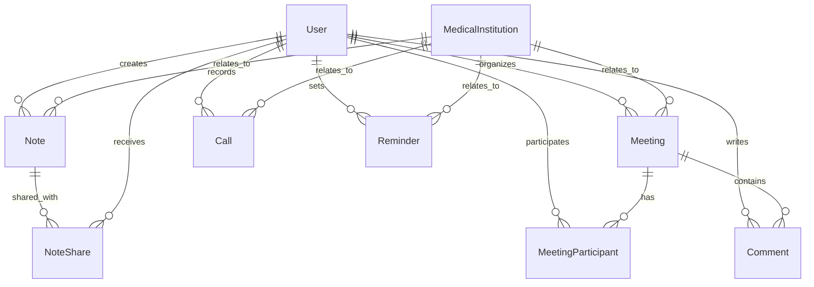

# Design Document

## Overview

Ce document décrit la conception des fonctionnalités de collaboration pour le CRM médical. Le système ajoute quatre nouveaux modèles de données (Note, Meeting, Call, Reminder) qui s'intègrent avec l'architecture existante basée sur Sequelize/TypeScript. La conception suit les mêmes patterns que le modèle Task existant pour maintenir la cohérence.

## Architecture

### Modèles de Données

Le système utilise une architecture basée sur des modèles Sequelize avec des relations bien définies :



### Intégration avec l'Architecture Existante

- **Base de données** : PostgreSQL avec Sequelize ORM (comme Task.ts)
- **Authentification** : Utilise le système User/Role existant
- **Permissions** : Basé sur les rôles utilisateur et équipes existants
- **API** : Suit les patterns REST existants
- **Validation** : Utilise les mêmes patterns de validation Sequelize

## Components and Interfaces

### 1. Note Model

```typescript
interface NoteAttributes {
  id: string
  title: string
  content: string
  tags: string[]
  creatorId: string
  institutionId?: string
  isPrivate: boolean
  createdAt: Date
  updatedAt: Date
}
```

**Fonctionnalités** :

- Création/modification/suppression de notes
- Système de tags pour l'organisation
- Partage avec des utilisateurs spécifiques
- Liaison optionnelle avec des institutions médicales

### 2. Meeting Model

```typescript
interface MeetingAttributes {
  id: string
  title: string
  description?: string
  startDate: Date
  endDate: Date
  location?: string
  organizerId: string
  institutionId?: string
  status: MeetingStatus
  createdAt: Date
  updatedAt: Date
}

enum MeetingStatus {
  SCHEDULED = "scheduled",
  IN_PROGRESS = "in_progress",
  COMPLETED = "completed",
  CANCELLED = "cancelled",
}
```

**Fonctionnalités** :

- Planification de réunions avec date/heure
- Gestion des participants
- Système de commentaires intégré
- Statuts de réunion (programmée, en cours, terminée, annulée)

### 3. Call Model

```typescript
interface CallAttributes {
  id: string
  phoneNumber: string
  duration?: number
  summary?: string
  callType: CallType
  userId: string
  institutionId?: string
  contactPersonId?: string
  createdAt: Date
  updatedAt: Date
}

enum CallType {
  INCOMING = "incoming",
  OUTGOING = "outgoing",
  MISSED = "missed",
}
```

**Fonctionnalités** :

- Enregistrement des appels entrants/sortants/manqués
- Liaison automatique avec les institutions/contacts
- Résumé et notes d'appel
- Durée et métadonnées

### 4. Reminder Model

```typescript
interface ReminderAttributes {
  id: string
  title: string
  description?: string
  reminderDate: Date
  isCompleted: boolean
  userId: string
  institutionId?: string
  priority: ReminderPriority
  createdAt: Date
  updatedAt: Date
}

enum ReminderPriority {
  LOW = "low",
  MEDIUM = "medium",
  HIGH = "high",
  URGENT = "urgent",
}
```

**Fonctionnalités** :

- Rappels personnels avec date/heure
- Niveaux de priorité (comme les tâches)
- Statut complété/non complété
- Liaison optionnelle avec des institutions

### 5. Modèles de Support

**NoteShare** : Gestion du partage de notes

```typescript
interface NoteShareAttributes {
  id: string
  noteId: string
  userId: string
  permission: SharePermission
  createdAt: Date
}

enum SharePermission {
  READ = "read",
  WRITE = "write",
}
```

**MeetingParticipant** : Participants aux réunions

```typescript
interface MeetingParticipantAttributes {
  id: string
  meetingId: string
  userId: string
  status: ParticipantStatus
  createdAt: Date
}

enum ParticipantStatus {
  INVITED = "invited",
  ACCEPTED = "accepted",
  DECLINED = "declined",
  TENTATIVE = "tentative",
}
```

**Comment** : Commentaires sur les réunions

```typescript
interface CommentAttributes {
  id: string
  content: string
  meetingId: string
  userId: string
  createdAt: Date
  updatedAt: Date
}
```

## Data Models

### Relations Sequelize

```typescript
// Note associations
Note.belongsTo(User, { foreignKey: "creatorId", as: "creator" })
Note.belongsTo(MedicalInstitution, { foreignKey: "institutionId", as: "institution" })
Note.hasMany(NoteShare, { foreignKey: "noteId", as: "shares" })

// Meeting associations
Meeting.belongsTo(User, { foreignKey: "organizerId", as: "organizer" })
Meeting.belongsTo(MedicalInstitution, { foreignKey: "institutionId", as: "institution" })
Meeting.hasMany(MeetingParticipant, { foreignKey: "meetingId", as: "participants" })
Meeting.hasMany(Comment, { foreignKey: "meetingId", as: "comments" })

// Call associations
Call.belongsTo(User, { foreignKey: "userId", as: "user" })
Call.belongsTo(MedicalInstitution, { foreignKey: "institutionId", as: "institution" })

// Reminder associations
Reminder.belongsTo(User, { foreignKey: "userId", as: "user" })
Reminder.belongsTo(MedicalInstitution, { foreignKey: "institutionId", as: "institution" })
```

### Index de Base de Données

Pour optimiser les performances, les index suivants seront créés :

```sql
-- Notes
CREATE INDEX idx_notes_creator_id ON notes(creator_id);
CREATE INDEX idx_notes_institution_id ON notes(institution_id);
CREATE INDEX idx_notes_tags ON notes USING gin(tags);
CREATE INDEX idx_notes_created_at ON notes(created_at);

-- Meetings
CREATE INDEX idx_meetings_organizer_id ON meetings(organizer_id);
CREATE INDEX idx_meetings_institution_id ON meetings(institution_id);
CREATE INDEX idx_meetings_start_date ON meetings(start_date);
CREATE INDEX idx_meetings_status ON meetings(status);

-- Calls
CREATE INDEX idx_calls_user_id ON calls(user_id);
CREATE INDEX idx_calls_institution_id ON calls(institution_id);
CREATE INDEX idx_calls_phone_number ON calls(phone_number);
CREATE INDEX idx_calls_created_at ON calls(created_at);

-- Reminders
CREATE INDEX idx_reminders_user_id ON reminders(user_id);
CREATE INDEX idx_reminders_reminder_date ON reminders(reminder_date);
CREATE INDEX idx_reminders_is_completed ON reminders(is_completed);
CREATE INDEX idx_reminders_priority ON reminders(priority);
```

## Error Handling

### Validation des Données

Chaque modèle implémente des validations Sequelize :

```typescript
// Exemple pour Note
title: {
  type: DataTypes.STRING,
  allowNull: false,
  validate: {
    len: [1, 255],
    notEmpty: true
  }
}

// Exemple pour Meeting
startDate: {
  type: DataTypes.DATE,
  allowNull: false,
  validate: {
    isDate: true,
    isAfterNow(value: Date) {
      if (value < new Date()) {
        throw new Error('Start date cannot be in the past')
      }
    }
  }
}
```

### Gestion des Erreurs API

- **400 Bad Request** : Données invalides ou manquantes
- **401 Unauthorized** : Authentification requise
- **403 Forbidden** : Permissions insuffisantes
- **404 Not Found** : Ressource non trouvée
- **409 Conflict** : Conflit de données (ex: réunion en double)
- **500 Internal Server Error** : Erreurs serveur

### Permissions et Sécurité

```typescript
// Exemple de vérification de permissions
async function canAccessNote(userId: string, noteId: string): Promise<boolean> {
  const note = await Note.findByPk(noteId, {
    include: [{ model: NoteShare, as: "shares" }],
  })

  if (!note) return false
  if (note.creatorId === userId) return true
  if (!note.isPrivate) return true

  return note.shares?.some((share) => share.userId === userId) || false
}
```

## Testing Strategy

### Tests Unitaires

Chaque modèle aura des tests couvrant :

```typescript
describe("Note Model", () => {
  test("should create note with valid data")
  test("should validate required fields")
  test("should handle tags correctly")
  test("should enforce sharing permissions")
  test("should link to institutions properly")
})

describe("Meeting Model", () => {
  test("should create meeting with participants")
  test("should validate date ranges")
  test("should handle status transitions")
  test("should manage comments")
})
```

### Tests d'Intégration

- Tests des endpoints API complets
- Tests des relations entre modèles
- Tests des permissions et sécurité
- Tests de performance avec données volumineuses

### Tests End-to-End

- Scénarios utilisateur complets
- Tests de l'interface utilisateur
- Tests de notifications
- Tests de synchronisation temps réel

### Stratégie de Migration

```typescript
// Migration pour créer les nouvelles tables
export async function up(queryInterface: QueryInterface) {
  await queryInterface.createTable("notes", {
    id: { type: DataTypes.UUID, primaryKey: true },
    title: { type: DataTypes.STRING, allowNull: false },
    // ... autres champs
  })

  await queryInterface.createTable("meetings", {
    // ... définition de la table
  })

  // Ajouter les contraintes de clés étrangères
  await queryInterface.addConstraint("notes", {
    fields: ["creator_id"],
    type: "foreign key",
    references: { table: "users", field: "id" },
  })
}
```

Cette conception assure une intégration harmonieuse avec l'architecture existante tout en ajoutant les fonctionnalités de collaboration demandées.
