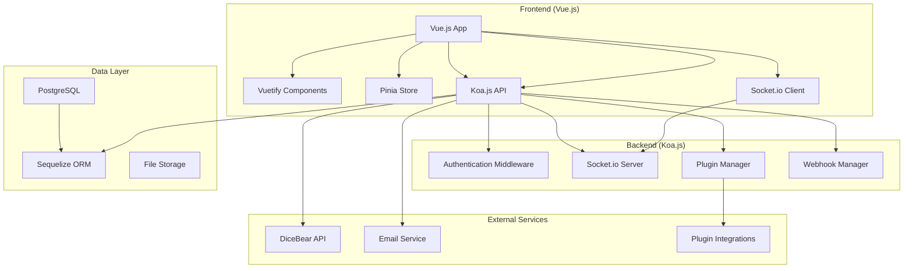
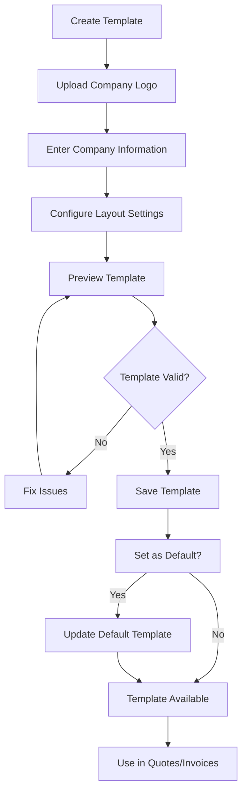
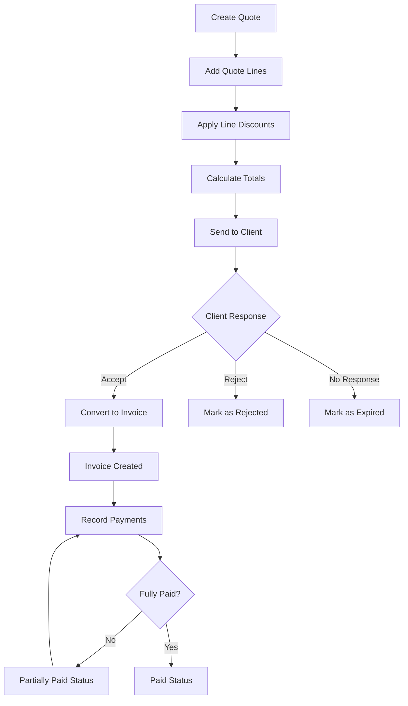

# Design Document

## Overview

The Modern Medical CRM is a comprehensive customer relationship management system designed specifically for businesses serving medical institutions (hospitals and clinics). The system follows a monorepo architecture with clear separation between frontend and backend services, providing real-time collaboration, medical-specific segmentation, billing capabilities, and extensible plugin architecture.

### Technology Stack

- **Frontend**: Vue.js 3 with Composition API, Vuetify 3 UI components, Pinia for state management, Vue I18n for internationalization
- **Backend**: Koa.js with TypeScript, Socket.io for real-time communication
- **Database**: PostgreSQL with Sequelize ORM for robust database operations
- **Authentication**: JWT tokens with refresh token rotation
- **File Storage**: Local file system with configurable cloud storage plugins
- **Monorepo Management**: Lerna or Nx for workspace management
- **Avatar Generation**: DiceBear API integration
- **Internationalization**: Vue I18n with support for multiple languages (French, English, Spanish, German)

## Architecture

### High-Level Architecture



### Monorepo Structure

```
medical-crm/
├── packages/
│   ├── frontend/          # Vue.js application
│   │   ├── src/
│   │   │   ├── components/
│   │   │   ├── views/
│   │   │   ├── stores/
│   │   │   ├── composables/
│   │   │   ├── plugins/
│   │   │   ├── locales/   # i18n translation files
│   │   │   └── assets/
│   │   ├── public/
│   │   └── package.json
│   ├── backend/           # Koa.js API server
│   │   ├── src/
│   │   │   ├── controllers/
│   │   │   ├── middleware/
│   │   │   ├── models/
│   │   │   ├── services/
│   │   │   ├── plugins/
│   │   │   └── utils/
│   │   └── package.json
│   ├── shared/            # Shared types and utilities
│   │   ├── types/
│   │   ├── constants/
│   │   └── utils/
│   └── plugins/           # Plugin packages
│       ├── sage-integration/
│       └── lms-connector/
├── migrations/            # Database schema and migrations
├── docker-compose.yml     # Development environment
├── package.json           # Root package.json
└── lerna.json            # Monorepo configuration
```

## Components and Interfaces

### Frontend Components

#### Core Components

- **AppLayout**: Main application shell with navigation and user context
- **MedicalInstitutionCard**: Display card for hospital/clinic information
- **TaskManager**: Team task assignment and tracking interface
- **QuoteBuilder**: Advanced quote creation with line-by-line discounts
- **InvoiceGenerator**: Flexible invoice creation and management
- **PaymentTracker**: Partial payment recording and tracking
- **BillingDashboard**: Overview of quotes, invoices, and payments
- **NotificationCenter**: Real-time notification display
- **PluginManager**: Plugin installation and configuration interface

#### Document Template Components

- **TemplateManager**: Template creation, editing, and management interface
- **TemplateEditor**: Visual template editor with drag-and-drop layout
- **LogoUploader**: Company logo upload and positioning component
- **CompanyInfoForm**: Form for entering administrative and legal information
- **TemplatePreview**: Real-time preview of template with sample data
- **TemplateSelector**: Template selection component for quotes and invoices

#### Medical-Specific Components

- **InstitutionSegmentation**: Advanced filtering by medical criteria
- **MedicalProfileForm**: Specialized form for medical institution data
- **CapacityAnalytics**: Charts for bed count, surgical rooms, equipment
- **ComplianceTracker**: Healthcare regulation compliance monitoring

### Backend Services

#### Core Services

- **AuthenticationService**: JWT token management and user authentication
- **MedicalInstitutionService**: CRUD operations for medical institutions
- **TaskService**: Team task management and assignment
- **QuoteService**: Quote creation, management, and conversion to invoices
- **InvoiceService**: Invoice generation, line management, and status tracking
- **PaymentService**: Payment recording, partial payment handling, and reconciliation
- **BillingCalculationService**: Complex discount and tax calculations
- **NotificationService**: Real-time notification broadcasting
- **WebhookService**: Webhook registration and delivery management

#### Document Template Services

- **DocumentTemplateService**: Template CRUD operations and validation
- **LogoUploadService**: Logo file upload, processing, and storage management
- **PDFGenerationService**: PDF generation using templates for quotes and invoices
- **TemplateValidationService**: Template format validation and compatibility checking

#### Plugin Architecture

- **PluginManager**: Dynamic plugin loading and lifecycle management
- **PluginRegistry**: Plugin discovery and dependency resolution
- **HookSystem**: Event-driven plugin integration points

### API Interfaces

#### REST API Endpoints

```typescript
// Authentication
POST /api/auth/login
POST /api/auth/refresh
POST /api/auth/logout

// Medical Institutions
GET /api/institutions
POST /api/institutions
GET /api/institutions/:id
PUT /api/institutions/:id
DELETE /api/institutions/:id
GET /api/institutions/search
POST /api/institutions/import

// Team Management
GET /api/users
POST /api/users
GET /api/users/:id/avatar
PUT /api/users/:id
GET /api/teams
POST /api/teams/:id/members

// Tasks
GET /api/tasks
POST /api/tasks
PUT /api/tasks/:id
DELETE /api/tasks/:id
GET /api/tasks/assigned/:userId

// Quotes
GET /api/quotes
POST /api/quotes
GET /api/quotes/:id
PUT /api/quotes/:id
DELETE /api/quotes/:id
PUT /api/quotes/:id/status
POST /api/quotes/:id/convert-to-invoice
GET /api/quotes/:id/pdf

// Quote Lines
GET /api/quotes/:id/lines
POST /api/quotes/:id/lines
PUT /api/quotes/:id/lines/:lineId
DELETE /api/quotes/:id/lines/:lineId

// Invoices
GET /api/invoices
POST /api/invoices
GET /api/invoices/:id
PUT /api/invoices/:id
DELETE /api/invoices/:id
PUT /api/invoices/:id/status
GET /api/invoices/:id/pdf
GET /api/invoices/:id/payments

// Invoice Lines
GET /api/invoices/:id/lines
POST /api/invoices/:id/lines
PUT /api/invoices/:id/lines/:lineId
DELETE /api/invoices/:id/lines/:lineId

// Payments
GET /api/payments
POST /api/payments
GET /api/payments/:id
PUT /api/payments/:id
DELETE /api/payments/:id
POST /api/invoices/:id/payments

// Webhooks
GET /api/webhooks
POST /api/webhooks
PUT /api/webhooks/:id
DELETE /api/webhooks/:id
GET /api/webhooks/:id/logs

// Document Templates
GET /api/templates
POST /api/templates
GET /api/templates/:id
PUT /api/templates/:id
DELETE /api/templates/:id
POST /api/templates/:id/duplicate
PUT /api/templates/:id/set-default
POST /api/templates/upload-logo
GET /api/templates/:id/preview

// Plugins
GET /api/plugins
POST /api/plugins/install
PUT /api/plugins/:id/configure
DELETE /api/plugins/:id
```

#### Socket.io Events

```typescript
// Client to Server
'join-room': { userId: string }
'task-update': { taskId: string, status: string }
'institution-view': { institutionId: string }

// Server to Client
'notification': { type: string, message: string, data: any }
'task-assigned': { task: Task, assignee: User }
'institution-updated': { institution: MedicalInstitution }
'team-activity': { user: User, action: string, target: string }
'webhook-triggered': { webhook: Webhook, payload: any }
```

## Data Models

### Core Entities

#### User Model

```typescript
interface User {
  id: string
  email: string
  firstName: string
  lastName: string
  role: UserRole
  teamId?: string
  avatarSeed: string // For DiceBear generation
  isActive: boolean
  lastLoginAt?: Date
  createdAt: Date
  updatedAt: Date
}

enum UserRole {
  SUPER_ADMIN = "super_admin",
  TEAM_ADMIN = "team_admin",
  USER = "user",
}
```

### Role-Based Access Control (RBAC)

#### Role Definitions and Permissions

```typescript
interface RolePermissions {
  // System Administration
  canManageSystem: boolean
  canManageAllTeams: boolean
  canManagePlugins: boolean
  canViewSystemLogs: boolean
  canManageSystemSettings: boolean

  // Team Management
  canManageTeam: boolean
  canManageTeamUsers: boolean
  canViewTeamAnalytics: boolean
  canManageTeamSettings: boolean

  // Medical Institutions
  canCreateInstitutions: boolean
  canEditAllInstitutions: boolean
  canEditAssignedInstitutions: boolean
  canDeleteInstitutions: boolean
  canImportInstitutions: boolean
  canViewAllInstitutions: boolean
  canViewAssignedInstitutions: boolean

  // Billing & Quotes
  canCreateQuotes: boolean
  canEditAllQuotes: boolean
  canEditOwnQuotes: boolean
  canDeleteQuotes: boolean
  canConvertQuotesToInvoices: boolean
  canCreateInvoices: boolean
  canEditAllInvoices: boolean
  canEditOwnInvoices: boolean
  canDeleteInvoices: boolean
  canRecordPayments: boolean
  canViewAllBilling: boolean
  canViewOwnBilling: boolean

  // Tasks
  canCreateTasks: boolean
  canAssignTasks: boolean
  canEditAllTasks: boolean
  canEditAssignedTasks: boolean
  canDeleteTasks: boolean
  canViewAllTasks: boolean
  canViewAssignedTasks: boolean

  // Webhooks & Integrations
  canManageWebhooks: boolean
  canViewWebhookLogs: boolean
  canManageIntegrations: boolean
}

// Role Permission Matrix
const ROLE_PERMISSIONS: Record<UserRole, RolePermissions> = {
  [UserRole.SUPER_ADMIN]: {
    // System Administration - Full Access
    canManageSystem: true,
    canManageAllTeams: true,
    canManagePlugins: true,
    canViewSystemLogs: true,
    canManageSystemSettings: true,

    // Team Management - Full Access
    canManageTeam: true,
    canManageTeamUsers: true,
    canViewTeamAnalytics: true,
    canManageTeamSettings: true,

    // Medical Institutions - Full Access
    canCreateInstitutions: true,
    canEditAllInstitutions: true,
    canEditAssignedInstitutions: true,
    canDeleteInstitutions: true,
    canImportInstitutions: true,
    canViewAllInstitutions: true,
    canViewAssignedInstitutions: true,

    // Billing & Quotes - Full Access
    canCreateQuotes: true,
    canEditAllQuotes: true,
    canEditOwnQuotes: true,
    canDeleteQuotes: true,
    canConvertQuotesToInvoices: true,
    canCreateInvoices: true,
    canEditAllInvoices: true,
    canEditOwnInvoices: true,
    canDeleteInvoices: true,
    canRecordPayments: true,
    canViewAllBilling: true,
    canViewOwnBilling: true,

    // Tasks - Full Access
    canCreateTasks: true,
    canAssignTasks: true,
    canEditAllTasks: true,
    canEditAssignedTasks: true,
    canDeleteTasks: true,
    canViewAllTasks: true,
    canViewAssignedTasks: true,

    // Webhooks & Integrations - Full Access
    canManageWebhooks: true,
    canViewWebhookLogs: true,
    canManageIntegrations: true,
  },

  [UserRole.TEAM_ADMIN]: {
    // System Administration - Limited Access
    canManageSystem: false,
    canManageAllTeams: false,
    canManagePlugins: false,
    canViewSystemLogs: false,
    canManageSystemSettings: false,

    // Team Management - Full Access for Own Team
    canManageTeam: true,
    canManageTeamUsers: true,
    canViewTeamAnalytics: true,
    canManageTeamSettings: true,

    // Medical Institutions - Full Access for Team
    canCreateInstitutions: true,
    canEditAllInstitutions: true,
    canEditAssignedInstitutions: true,
    canDeleteInstitutions: true,
    canImportInstitutions: true,
    canViewAllInstitutions: true,
    canViewAssignedInstitutions: true,

    // Billing & Quotes - Full Access for Team
    canCreateQuotes: true,
    canEditAllQuotes: true,
    canEditOwnQuotes: true,
    canDeleteQuotes: true,
    canConvertQuotesToInvoices: true,
    canCreateInvoices: true,
    canEditAllInvoices: true,
    canEditOwnInvoices: true,
    canDeleteInvoices: true,
    canRecordPayments: true,
    canViewAllBilling: true,
    canViewOwnBilling: true,

    // Tasks - Full Access for Team
    canCreateTasks: true,
    canAssignTasks: true,
    canEditAllTasks: true,
    canEditAssignedTasks: true,
    canDeleteTasks: true,
    canViewAllTasks: true,
    canViewAssignedTasks: true,

    // Webhooks & Integrations - Limited Access
    canManageWebhooks: true,
    canViewWebhookLogs: true,
    canManageIntegrations: false,
  },

  [UserRole.USER]: {
    // System Administration - No Access
    canManageSystem: false,
    canManageAllTeams: false,
    canManagePlugins: false,
    canViewSystemLogs: false,
    canManageSystemSettings: false,

    // Team Management - No Access
    canManageTeam: false,
    canManageTeamUsers: false,
    canViewTeamAnalytics: false,
    canManageTeamSettings: false,

    // Medical Institutions - Limited Access
    canCreateInstitutions: true,
    canEditAllInstitutions: false,
    canEditAssignedInstitutions: true,
    canDeleteInstitutions: false,
    canImportInstitutions: false,
    canViewAllInstitutions: true,
    canViewAssignedInstitutions: true,

    // Billing & Quotes - Limited Access
    canCreateQuotes: true,
    canEditAllQuotes: false,
    canEditOwnQuotes: true,
    canDeleteQuotes: false,
    canConvertQuotesToInvoices: true,
    canCreateInvoices: true,
    canEditAllInvoices: false,
    canEditOwnInvoices: true,
    canDeleteInvoices: false,
    canRecordPayments: true,
    canViewAllBilling: false,
    canViewOwnBilling: true,

    // Tasks - Limited Access
    canCreateTasks: true,
    canAssignTasks: false,
    canEditAllTasks: false,
    canEditAssignedTasks: true,
    canDeleteTasks: false,
    canViewAllTasks: true,
    canViewAssignedTasks: true,

    // Webhooks & Integrations - No Access
    canManageWebhooks: false,
    canViewWebhookLogs: false,
    canManageIntegrations: false,
  },
}
```

#### Permission Middleware Implementation

```typescript
// Permission checking middleware
function requirePermission(permission: keyof RolePermissions) {
  return async (ctx: Context, next: Next) => {
    const user = ctx.state.user as User
    const userPermissions = ROLE_PERMISSIONS[user.role]

    if (!userPermissions[permission]) {
      throw createError(
        "Insufficient permissions to access this resource",
        403,
        "INSUFFICIENT_PERMISSIONS",
        {
          required: permission,
          userRole: user.role,
        }
      )
    }

    await next()
  }
}

// Team-based permission checking
function requireTeamPermission(permission: keyof RolePermissions) {
  return async (ctx: Context, next: Next) => {
    const user = ctx.state.user as User
    const userPermissions = ROLE_PERMISSIONS[user.role]

    // Super admins can access everything
    if (user.role === UserRole.SUPER_ADMIN) {
      await next()
      return
    }

    // Team admins can access their team's resources
    if (user.role === UserRole.TEAM_ADMIN && userPermissions[permission]) {
      // Additional team validation logic here
      await next()
      return
    }

    // Users can only access their own resources
    if (user.role === UserRole.USER && userPermissions[permission]) {
      // Additional ownership validation logic here
      await next()
      return
    }

    throw createError(
      "Insufficient permissions to access this resource",
      403,
      "INSUFFICIENT_PERMISSIONS"
    )
  }
}
```

#### Medical Institution Model

```typescript
interface MedicalInstitution {
  id: string
  name: string
  type: InstitutionType
  address: Address
  contactPersons: ContactPerson[]
  medicalProfile: MedicalProfile
  assignedUserId?: string
  tags: string[]
  createdAt: Date
  updatedAt: Date
}

enum InstitutionType {
  HOSPITAL = "hospital",
  CLINIC = "clinic",
  MEDICAL_CENTER = "medical_center",
  SPECIALTY_CLINIC = "specialty_clinic",
}

interface MedicalProfile {
  bedCapacity?: number
  surgicalRooms?: number
  specialties: string[]
  departments: string[]
  equipmentTypes: string[]
  certifications: string[]
  complianceStatus: ComplianceStatus
}

interface ComplianceStatus {
  isCompliant: boolean
  lastAuditDate?: Date
  expirationDate?: Date
  notes?: string
}
```

#### Task Model

```typescript
interface Task {
  id: string
  title: string
  description?: string
  status: TaskStatus
  priority: TaskPriority
  assigneeId: string
  creatorId: string
  institutionId?: string
  dueDate?: Date
  completedAt?: Date
  createdAt: Date
  updatedAt: Date
}

enum TaskStatus {
  TODO = "todo",
  IN_PROGRESS = "in_progress",
  COMPLETED = "completed",
  CANCELLED = "cancelled",
}

enum TaskPriority {
  LOW = "low",
  MEDIUM = "medium",
  HIGH = "high",
  URGENT = "urgent",
}
```

#### Quote Model

```typescript
interface Quote {
  id: string
  quoteNumber: string
  institutionId: string
  assignedUserId: string
  templateId?: string // Reference to document template
  title: string
  description?: string
  validUntil: Date
  status: QuoteStatus
  acceptedAt?: Date
  rejectedAt?: Date
  clientComments?: string
  internalNotes?: string

  // Financial totals
  subtotal: number
  totalDiscountAmount: number
  totalTaxAmount: number
  total: number

  // Metadata
  createdAt: Date
  updatedAt: Date
}

enum QuoteStatus {
  DRAFT = "draft",
  SENT = "sent",
  ACCEPTED = "accepted",
  REJECTED = "rejected",
  EXPIRED = "expired",
  CANCELLED = "cancelled",
}

interface QuoteLine {
  id: string
  quoteId: string
  orderIndex: number

  // Product/Service details
  description: string
  quantity: number
  unitPrice: number

  // Discount per line
  discountType: DiscountType
  discountValue: number
  discountAmount: number

  // Tax per line
  taxRate: number
  taxAmount: number

  // Calculated totals
  subtotal: number // quantity * unitPrice
  totalAfterDiscount: number // subtotal - discountAmount
  total: number // totalAfterDiscount + taxAmount

  createdAt: Date
  updatedAt: Date
}
```

#### Invoice Model

```typescript
interface Invoice {
  id: string
  invoiceNumber: string
  institutionId: string
  assignedUserId: string
  quoteId?: string // Reference to original quote if converted
  templateId?: string // Reference to document template

  title: string
  description?: string
  dueDate: Date
  status: InvoiceStatus

  // Payment tracking
  totalPaid: number
  remainingAmount: number
  lastPaymentDate?: Date

  // Financial totals
  subtotal: number
  totalDiscountAmount: number
  totalTaxAmount: number
  total: number

  // Metadata
  sentAt?: Date
  paidAt?: Date // When fully paid
  createdAt: Date
  updatedAt: Date
}

enum InvoiceStatus {
  DRAFT = "draft",
  SENT = "sent",
  PARTIALLY_PAID = "partially_paid",
  PAID = "paid",
  OVERDUE = "overdue",
  CANCELLED = "cancelled",
}

interface InvoiceLine {
  id: string
  invoiceId: string
  orderIndex: number

  // Product/Service details
  description: string
  quantity: number
  unitPrice: number

  // Discount per line
  discountType: DiscountType
  discountValue: number
  discountAmount: number

  // Tax per line
  taxRate: number
  taxAmount: number

  // Calculated totals
  subtotal: number // quantity * unitPrice
  totalAfterDiscount: number // subtotal - discountAmount
  total: number // totalAfterDiscount + taxAmount

  createdAt: Date
  updatedAt: Date
}

enum DiscountType {
  PERCENTAGE = "percentage",
  FIXED_AMOUNT = "fixed_amount",
}
```

#### Payment Model

```typescript
interface Payment {
  id: string
  invoiceId: string

  // Payment details
  amount: number
  paymentDate: Date
  paymentMethod: PaymentMethod
  reference?: string // Bank reference, check number, etc.

  // Status and notes
  status: PaymentStatus
  notes?: string

  // Metadata
  recordedBy: string // User who recorded the payment
  createdAt: Date
  updatedAt: Date
}

enum PaymentMethod {
  BANK_TRANSFER = "bank_transfer",
  CHECK = "check",
  CASH = "cash",
  CREDIT_CARD = "credit_card",
  OTHER = "other",
}

enum PaymentStatus {
  PENDING = "pending",
  CONFIRMED = "confirmed",
  FAILED = "failed",
  CANCELLED = "cancelled",
}
```

#### Document Template Model

```typescript
interface DocumentTemplate {
  id: string
  name: string
  type: TemplateType
  isDefault: boolean
  isActive: boolean

  // Company Information
  companyName: string
  companyAddress: Address
  companyPhone?: string
  companyEmail?: string
  companyWebsite?: string

  // Tax and Legal Information
  taxNumber?: string
  vatNumber?: string
  siretNumber?: string
  registrationNumber?: string

  // Logo and Branding
  logoUrl?: string
  logoPosition: LogoPosition
  primaryColor?: string
  secondaryColor?: string

  // Template Layout Settings
  headerHeight: number
  footerHeight: number
  marginTop: number
  marginBottom: number
  marginLeft: number
  marginRight: number

  // Custom Fields and Text
  customHeader?: string
  customFooter?: string
  termsAndConditions?: string
  paymentInstructions?: string

  // Metadata
  createdBy: string
  version: number
  createdAt: Date
  updatedAt: Date
}

enum TemplateType {
  QUOTE = "quote",
  INVOICE = "invoice",
  BOTH = "both",
}

enum LogoPosition {
  TOP_LEFT = "top_left",
  TOP_CENTER = "top_center",
  TOP_RIGHT = "top_right",
  HEADER_LEFT = "header_left",
  HEADER_RIGHT = "header_right",
}

interface Address {
  street: string
  city: string
  state: string
  zipCode: string
  country: string
}
```

### Database Schema Design

The system uses PostgreSQL with the following key design principles:

- **Normalization**: Proper table relationships to avoid data duplication
- **Indexing**: Strategic indexes on frequently queried fields
- **Constraints**: Foreign key constraints and check constraints for data integrity
- **Audit Trail**: Created/updated timestamps on all entities
- **Soft Deletes**: Logical deletion for important business data

## Error Handling

### Frontend Error Handling

- **Global Error Handler**: Vue.js global error handler for unhandled exceptions
- **API Error Interceptor**: Axios interceptor for consistent API error handling
- **User-Friendly Messages**: Translation of technical errors to user-friendly messages
- **Retry Logic**: Automatic retry for transient network errors
- **Offline Support**: Graceful degradation when network is unavailable

### Backend Error Handling

- **Structured Error Responses**: Consistent error response format across all endpoints
- **Error Logging**: Comprehensive error logging with context and stack traces
- **Validation Errors**: Detailed validation error messages for form submissions
- **Rate Limiting**: Protection against abuse with appropriate error responses
- **Database Error Handling**: Proper handling of database constraints and connection issues

### Error Response Format

```typescript
interface ErrorResponse {
  error: {
    code: string
    message: string
    details?: any
    timestamp: string
    requestId: string
  }
}
```

## Testing Strategy

### Frontend Testing

- **Unit Tests**: Vue Test Utils for component testing
- **Integration Tests**: Testing component interactions and API integration
- **E2E Tests**: Cypress for critical user workflows
- **Visual Regression**: Screenshot testing for UI consistency
- **Accessibility Testing**: Automated accessibility compliance testing

### Backend Testing

- **Unit Tests**: Jest for service and utility function testing
- **Integration Tests**: API endpoint testing with test database
- **Database Tests**: Testing database operations and migrations
- **Plugin Tests**: Testing plugin loading and execution
- **Performance Tests**: Load testing for critical endpoints

### Test Coverage Goals

- **Unit Tests**: 80% code coverage minimum
- **Integration Tests**: All API endpoints covered
- **E2E Tests**: Critical user journeys covered
- **Plugin Tests**: All plugin interfaces tested

### Testing Infrastructure

- **Test Database**: Separate PostgreSQL instance for testing
- **Mock Services**: Mocked external services (DiceBear, email, etc.)
- **CI/CD Integration**: Automated testing in GitHub Actions
- **Test Data Management**: Seeded test data for consistent testing

## Document Template System

### Template Management Workflow



### Template Features

#### Company Branding

- **Logo Management**: Upload, position, and resize company logos
- **Color Scheme**: Primary and secondary colors for consistent branding
- **Layout Control**: Margins, header/footer heights, and positioning

#### Administrative Information

- **Company Details**: Name, address, contact information
- **Legal Information**: Tax numbers, VAT, SIRET, registration numbers
- **Custom Content**: Terms and conditions, payment instructions

#### Template Types

- **Quote Templates**: Optimized for quote generation and client presentation
- **Invoice Templates**: Designed for formal invoicing with payment details
- **Universal Templates**: Can be used for both quotes and invoices

### PDF Generation Integration

```typescript
// Template-based PDF generation
interface PDFGenerationOptions {
  templateId?: string
  documentType: "quote" | "invoice"
  documentData: Quote | Invoice
  includeCompanyBranding: boolean
  customizations?: {
    headerText?: string
    footerText?: string
    logoOverride?: string
  }
}

// PDF generation service
class PDFGenerationService {
  async generateDocument(options: PDFGenerationOptions): Promise<Buffer> {
    const template = await this.getTemplate(options.templateId, options.documentType)
    const compiledTemplate = await this.compileTemplate(template, options.documentData)
    return this.renderToPDF(compiledTemplate, template.layoutSettings)
  }

  private async getTemplate(
    templateId?: string,
    documentType: string
  ): Promise<DocumentTemplate> {
    if (templateId) {
      return DocumentTemplateService.findById(templateId)
    }
    return DocumentTemplateService.getDefaultTemplate(documentType)
  }
}
```

## Billing Workflow and Business Logic

### Quote to Invoice Workflow



### Payment Processing Logic

- **Partial Payments**: Multiple payment records can be associated with a single invoice
- **Automatic Status Updates**: Invoice status automatically updates based on total payments received
- **Payment Reconciliation**: Track payment methods, references, and dates for accounting integration
- **Overdue Management**: Automatic calculation of overdue status based on due dates and payment status

### Discount Calculation System

```typescript
// Line-level discount calculation
function calculateLineTotal(line: QuoteLine | InvoiceLine): number {
  const subtotal = line.quantity * line.unitPrice

  let discountAmount = 0
  if (line.discountType === DiscountType.PERCENTAGE) {
    discountAmount = subtotal * (line.discountValue / 100)
  } else if (line.discountType === DiscountType.FIXED_AMOUNT) {
    discountAmount = line.discountValue
  }

  const totalAfterDiscount = subtotal - discountAmount
  const taxAmount = totalAfterDiscount * (line.taxRate / 100)

  return totalAfterDiscount + taxAmount
}

// Document-level total calculation
function calculateDocumentTotal(lines: (QuoteLine | InvoiceLine)[]): DocumentTotals {
  const subtotal = lines.reduce((sum, line) => sum + line.quantity * line.unitPrice, 0)
  const totalDiscountAmount = lines.reduce((sum, line) => sum + line.discountAmount, 0)
  const totalTaxAmount = lines.reduce((sum, line) => sum + line.taxAmount, 0)
  const total = lines.reduce((sum, line) => sum + line.total, 0)

  return { subtotal, totalDiscountAmount, totalTaxAmount, total }
}
```

## Internationalization (i18n)

### Supported Languages

The Medical CRM system supports multiple languages to serve international healthcare markets:

- **French (fr)**: Primary language, complete translation
- **English (en)**: Secondary language, complete translation
- **Spanish (es)**: Tertiary language, complete translation
- **German (de)**: Quaternary language, complete translation

### Translation Architecture

```typescript
// i18n configuration
interface I18nConfig {
  locale: string
  fallbackLocale: string
  messages: Record<string, any>
  dateTimeFormats: Record<string, any>
  numberFormats: Record<string, any>
}

// Translation structure
interface TranslationMessages {
  common: {
    actions: {
      save: string
      cancel: string
      delete: string
      edit: string
      create: string
      search: string
      filter: string
      export: string
      import: string
    }
    labels: {
      name: string
      email: string
      phone: string
      address: string
      status: string
      date: string
      amount: string
    }
    messages: {
      success: string
      error: string
      warning: string
      info: string
      loading: string
      noData: string
    }
  }
  auth: {
    login: string
    logout: string
    password: string
    forgotPassword: string
    rememberMe: string
    invalidCredentials: string
  }
  institutions: {
    title: string
    hospital: string
    clinic: string
    medicalCenter: string
    specialtyClinic: string
    bedCapacity: string
    surgicalRooms: string
    specialties: string
    departments: string
  }
  billing: {
    quote: string
    invoice: string
    payment: string
    total: string
    subtotal: string
    discount: string
    tax: string
    dueDate: string
    paymentMethod: string
  }
  tasks: {
    title: string
    description: string
    priority: string
    assignee: string
    dueDate: string
    status: {
      todo: string
      inProgress: string
      completed: string
      cancelled: string
    }
    priority: {
      low: string
      medium: string
      high: string
      urgent: string
    }
  }
  plugins: {
    title: string
    install: string
    configure: string
    enable: string
    disable: string
    uninstall: string
    status: {
      enabled: string
      disabled: string
      error: string
      loading: string
    }
    categories: {
      integration: string
      billing: string
      notification: string
      analytics: string
      workflow: string
      utility: string
    }
  }
}
```

### Localization Features

#### Date and Time Formatting

```typescript
// Date/time formats per locale
const dateTimeFormats = {
  fr: {
    short: { year: "numeric", month: "short", day: "numeric" },
    long: { year: "numeric", month: "long", day: "numeric", weekday: "long" },
    time: { hour: "2-digit", minute: "2-digit", hour12: false },
  },
  en: {
    short: { year: "numeric", month: "short", day: "numeric" },
    long: { year: "numeric", month: "long", day: "numeric", weekday: "long" },
    time: { hour: "2-digit", minute: "2-digit", hour12: true },
  },
  es: {
    short: { year: "numeric", month: "short", day: "numeric" },
    long: { year: "numeric", month: "long", day: "numeric", weekday: "long" },
    time: { hour: "2-digit", minute: "2-digit", hour12: false },
  },
  de: {
    short: { year: "numeric", month: "short", day: "numeric" },
    long: { year: "numeric", month: "long", day: "numeric", weekday: "long" },
    time: { hour: "2-digit", minute: "2-digit", hour12: false },
  },
}
```

#### Number and Currency Formatting

```typescript
// Number formats per locale
const numberFormats = {
  fr: {
    currency: { style: "currency", currency: "EUR", notation: "standard" },
    decimal: { minimumFractionDigits: 2, maximumFractionDigits: 2 },
    percent: { style: "percent", minimumFractionDigits: 1 },
  },
  en: {
    currency: { style: "currency", currency: "USD", notation: "standard" },
    decimal: { minimumFractionDigits: 2, maximumFractionDigits: 2 },
    percent: { style: "percent", minimumFractionDigits: 1 },
  },
  es: {
    currency: { style: "currency", currency: "EUR", notation: "standard" },
    decimal: { minimumFractionDigits: 2, maximumFractionDigits: 2 },
    percent: { style: "percent", minimumFractionDigits: 1 },
  },
  de: {
    currency: { style: "currency", currency: "EUR", notation: "standard" },
    decimal: { minimumFractionDigits: 2, maximumFractionDigits: 2 },
    percent: { style: "percent", minimumFractionDigits: 1 },
  },
}
```

### Translation Management

#### File Structure

```
src/locales/
├── fr/
│   ├── common.json
│   ├── auth.json
│   ├── institutions.json
│   ├── billing.json
│   ├── tasks.json
│   └── plugins.json
├── en/
│   ├── common.json
│   ├── auth.json
│   ├── institutions.json
│   ├── billing.json
│   ├── tasks.json
│   └── plugins.json
├── es/
│   └── ... (same structure)
└── de/
    └── ... (same structure)
```

#### Dynamic Loading

```typescript
// Lazy loading of translation files
const loadLocaleMessages = async (locale: string) => {
  const messages = await Promise.all([
    import(`@/locales/${locale}/common.json`),
    import(`@/locales/${locale}/auth.json`),
    import(`@/locales/${locale}/institutions.json`),
    import(`@/locales/${locale}/billing.json`),
    import(`@/locales/${locale}/tasks.json`),
    import(`@/locales/${locale}/plugins.json`),
  ])

  return {
    common: messages[0].default,
    auth: messages[1].default,
    institutions: messages[2].default,
    billing: messages[3].default,
    tasks: messages[4].default,
    plugins: messages[5].default,
  }
}
```

### User Language Preferences

#### Language Selection

- **Browser Detection**: Automatic detection of user's browser language
- **User Preference**: Stored in user profile and localStorage
- **Fallback Logic**: French → English → Browser default
- **Real-time Switching**: Change language without page reload

#### Persistence

```typescript
// Language preference storage
interface UserLanguagePreference {
  userId: string
  locale: string
  dateFormat: string
  timeFormat: string
  currency: string
  timezone: string
}

// Store in user profile and sync across devices
const updateUserLanguage = async (userId: string, locale: string) => {
  await userApi.updateProfile(userId, { preferredLocale: locale })
  localStorage.setItem("user-locale", locale)
  i18n.global.locale.value = locale
}
```

## Vuetify Integration

### Component Library

The system uses Vuetify 3 as the primary UI component library, providing:

- **Material Design 3**: Modern, accessible design system
- **Responsive Layout**: Mobile-first responsive components
- **Theme System**: Customizable themes with dark/light mode support
- **Accessibility**: Built-in ARIA support and keyboard navigation
- **Performance**: Tree-shaking and optimized bundle size

### Theme Configuration

```typescript
// Vuetify theme configuration
const vuetifyTheme = {
  defaultTheme: "light",
  themes: {
    light: {
      colors: {
        primary: "#1976D2", // Medical blue
        secondary: "#424242", // Dark grey
        accent: "#82B1FF", // Light blue
        error: "#FF5252", // Red
        info: "#2196F3", // Blue
        success: "#4CAF50", // Green
        warning: "#FFC107", // Amber
        surface: "#FFFFFF", // White
        background: "#F5F5F5", // Light grey
      },
    },
    dark: {
      colors: {
        primary: "#2196F3", // Lighter blue for dark mode
        secondary: "#616161", // Medium grey
        accent: "#FF4081", // Pink accent
        error: "#FF5252", // Red
        info: "#2196F3", // Blue
        success: "#4CAF50", // Green
        warning: "#FF9800", // Orange
        surface: "#121212", // Dark surface
        background: "#000000", // Black
      },
    },
  },
}
```

### Custom Components

#### Medical-Specific Components

```vue
<!-- MedicalInstitutionCard.vue -->
<template>
  <v-card class="medical-institution-card" elevation="2">
    <v-card-title class="d-flex align-center">
      <v-icon :icon="getInstitutionIcon(institution.type)" class="me-2" />
      {{ institution.name }}
      <v-spacer />
      <v-chip :color="getStatusColor(institution.status)" size="small">
        {{ $t(`institutions.status.${institution.status}`) }}
      </v-chip>
    </v-card-title>

    <v-card-text>
      <v-row>
        <v-col cols="12" md="6">
          <div class="text-caption text-medium-emphasis">
            {{ $t("institutions.type") }}
          </div>
          <div class="text-body-2">
            {{ $t(`institutions.types.${institution.type}`) }}
          </div>
        </v-col>
        <v-col cols="12" md="6">
          <div class="text-caption text-medium-emphasis">
            {{ $t("institutions.bedCapacity") }}
          </div>
          <div class="text-body-2">
            {{ institution.medicalProfile.bedCapacity || $t("common.notSpecified") }}
          </div>
        </v-col>
      </v-row>
    </v-card-text>

    <v-card-actions>
      <v-btn variant="text" color="primary" @click="$emit('view', institution)">
        {{ $t("common.actions.view") }}
      </v-btn>
      <v-btn variant="text" color="primary" @click="$emit('edit', institution)">
        {{ $t("common.actions.edit") }}
      </v-btn>
    </v-card-actions>
  </v-card>
</template>
```

#### Responsive Data Tables

```vue
<!-- ResponsiveDataTable.vue -->
<template>
  <v-data-table
    :headers="localizedHeaders"
    :items="items"
    :loading="loading"
    :search="search"
    class="responsive-data-table"
  >
    <template #top>
      <v-toolbar flat>
        <v-toolbar-title>{{ title }}</v-toolbar-title>
        <v-spacer />
        <v-text-field
          v-model="search"
          :label="$t('common.actions.search')"
          prepend-inner-icon="mdi-magnify"
          variant="outlined"
          density="compact"
          single-line
          hide-details
        />
      </v-toolbar>
    </template>

    <template #item.actions="{ item }">
      <v-btn-group variant="text" density="compact">
        <v-btn icon="mdi-eye" @click="$emit('view', item)" />
        <v-btn icon="mdi-pencil" @click="$emit('edit', item)" />
        <v-btn icon="mdi-delete" color="error" @click="$emit('delete', item)" />
      </v-btn-group>
    </template>

    <template #no-data>
      <v-empty-state
        :headline="$t('common.messages.noData')"
        :title="$t('common.messages.noDataDescription')"
        icon="mdi-database-off"
      />
    </template>
  </v-data-table>
</template>
```

### Form Components

#### Internationalized Forms

```vue
<!-- InstitutionForm.vue -->
<template>
  <v-form ref="form" v-model="valid" @submit.prevent="handleSubmit">
    <v-container>
      <v-row>
        <v-col cols="12" md="6">
          <v-text-field
            v-model="formData.name"
            :label="$t('institutions.name')"
            :rules="nameRules"
            variant="outlined"
            required
          />
        </v-col>
        <v-col cols="12" md="6">
          <v-select
            v-model="formData.type"
            :items="institutionTypes"
            :label="$t('institutions.type')"
            :rules="typeRules"
            variant="outlined"
            required
          />
        </v-col>
      </v-row>

      <v-row>
        <v-col cols="12">
          <v-textarea
            v-model="formData.description"
            :label="$t('institutions.description')"
            variant="outlined"
            rows="3"
          />
        </v-col>
      </v-row>

      <v-row>
        <v-col cols="12" md="4">
          <v-text-field
            v-model="formData.medicalProfile.bedCapacity"
            :label="$t('institutions.bedCapacity')"
            type="number"
            variant="outlined"
            min="0"
          />
        </v-col>
        <v-col cols="12" md="4">
          <v-text-field
            v-model="formData.medicalProfile.surgicalRooms"
            :label="$t('institutions.surgicalRooms')"
            type="number"
            variant="outlined"
            min="0"
          />
        </v-col>
        <v-col cols="12" md="4">
          <v-select
            v-model="formData.medicalProfile.specialties"
            :items="medicalSpecialties"
            :label="$t('institutions.specialties')"
            variant="outlined"
            multiple
            chips
          />
        </v-col>
      </v-row>
    </v-container>

    <v-card-actions>
      <v-spacer />
      <v-btn variant="text" @click="$emit('cancel')">
        {{ $t("common.actions.cancel") }}
      </v-btn>
      <v-btn
        type="submit"
        color="primary"
        variant="elevated"
        :loading="loading"
        :disabled="!valid"
      >
        {{ $t("common.actions.save") }}
      </v-btn>
    </v-card-actions>
  </v-form>
</template>

<script setup lang="ts">
import { computed } from "vue"
import { useI18n } from "vue-i18n"

const { t } = useI18n()

const institutionTypes = computed(() => [
  { title: t("institutions.types.hospital"), value: "hospital" },
  { title: t("institutions.types.clinic"), value: "clinic" },
  { title: t("institutions.types.medicalCenter"), value: "medical_center" },
  { title: t("institutions.types.specialtyClinic"), value: "specialty_clinic" },
])

const nameRules = computed(() => [
  (v: string) => !!v || t("validation.required", { field: t("institutions.name") }),
  (v: string) =>
    v.length >= 2 || t("validation.minLength", { field: t("institutions.name"), min: 2 }),
])
</script>
```

## Security Considerations

### Authentication & Authorization

- **JWT Tokens**: Short-lived access tokens with refresh token rotation
- **Role-Based Access Control**: Granular permissions based on user roles
- **Session Management**: Secure session handling with proper logout
- **Password Security**: Bcrypt hashing with appropriate salt rounds

### Data Protection

- **Encryption at Rest**: Sensitive data encrypted in database
- **Encryption in Transit**: HTTPS/TLS for all communications
- **Input Validation**: Comprehensive input sanitization and validation
- **SQL Injection Prevention**: Parameterized queries through Sequelize ORM

### Healthcare Compliance

- **HIPAA Considerations**: Data handling practices for healthcare data
- **Audit Logging**: Comprehensive audit trail for data access
- **Data Retention**: Configurable data retention policies
- **Access Logging**: Detailed logging of all data access attempts

## Performance Optimization

### Frontend Performance

- **Code Splitting**: Lazy loading of routes and components
- **Bundle Optimization**: Tree shaking and minification
- **Caching Strategy**: Browser caching for static assets
- **Virtual Scrolling**: Efficient rendering of large lists
- **Image Optimization**: Optimized avatar loading from DiceBear

### Backend Performance

- **Database Optimization**: Proper indexing and query optimization
- **Caching Layer**: Redis caching for frequently accessed data
- **Connection Pooling**: Efficient database connection management
- **API Rate Limiting**: Protection against abuse and overload
- **Background Jobs**: Asynchronous processing for heavy operations

### Real-time Performance

- **Socket.io Optimization**: Efficient room management and message broadcasting
- **Connection Management**: Proper handling of connection lifecycle
- **Message Queuing**: Reliable message delivery with queuing
- **Scalability**: Horizontal scaling considerations for Socket.io
